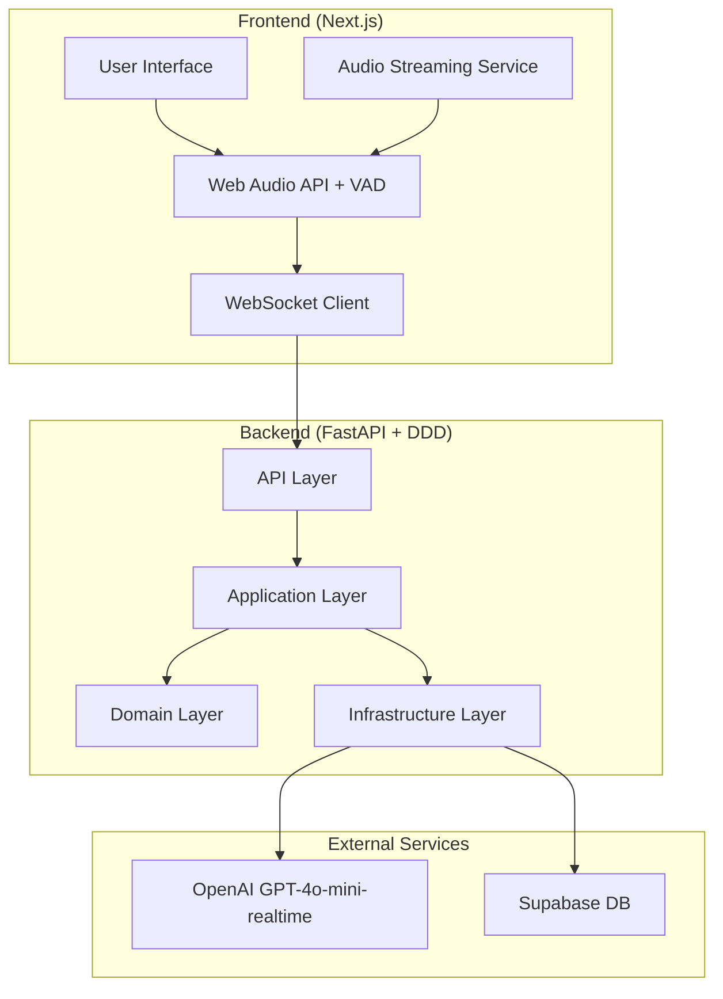

# System Patterns: Conversation Simulator

## System Architecture



## Domain-Driven Design Architecture

### **Capa API (Presentation Layer)**

**Propósito**: Exposición de funcionalidad a través de HTTP/WebSockets

- **Routes**: Endpoints REST y WebSocket handlers
- **Schemas**: Request/Response models (Pydantic)
- **Middleware**: CORS, logging, error handling
- **Dependencies**: Dependency injection container

### **Capa Application (Application Layer)**

**Propósito**: Orquesta la lógica de negocio y coordina casos de uso

- **Commands**: Acciones que cambian estado (start_conversation, send_message)
- **Queries**: Acciones que solo leen (get_conversation, get_personas)
- **Handlers**: Manejadores de comandos y queries
- **Services**: Servicios de aplicación que coordinan entre dominios
- **DTOs**: Data Transfer Objects para comunicación entre capas

### **Capa Domain (Domain Layer)**

**Propósito**: Contiene la lógica de negocio pura y reglas del dominio

- **Entities**: Objetos con identidad (Conversation, Persona, Message)
- **Value Objects**: Objetos inmutables (ConversationId, MessageContent)
- **Repositories**: Interfaces abstractas para persistencia
- **Services**: Servicios de dominio con lógica de negocio
- **Events**: Eventos de dominio para comunicación asíncrona

### **Capa Infrastructure (Infrastructure Layer)**

**Propósito**: Implementa interfaces del dominio y maneja detalles técnicos

- **Repositories**: Implementaciones concretas (SQL, YAML, etc.)
- **Services**: Servicios técnicos (AI, TTS, STT, WebSocket)
- **Mappers**: Conversión entre entidades y DTOs
- **External APIs**: Clientes para servicios externos
- **Database**: Configuración y migraciones de BD

### **Flujo de Dependencias**

```mermaid
API Layer → Application Layer → Domain Layer
     ↓              ↓              ↓
Infrastructure Layer (implementa interfaces del dominio)
```

### **Bounded Contexts**

- **Conversation**: Gestión de conversaciones y mensajes
- **Persona**: Perfiles de clientes simulados
- **Analysis**: Análisis de conversaciones y métricas
- **Audio**: Procesamiento de audio (STT/TTS)
- **Shared**: Eventos, value objects, infraestructura común

## Backend Architecture (Domain-Driven Design)

### **Estructura DDD del Backend**

```mermaid
backend/src/
├── shared/                      # Shared Kernel
│   ├── domain/
│   │   ├── events.py           # Domain Events
│   │   ├── value_objects.py    # Value Objects compartidos
│   │   └── exceptions.py       # Domain Exceptions
│   └── infrastructure/
│       ├── database/           # DB config, migrations
│       ├── messaging/          # Event bus, message queue
│       └── external_apis/      # AI providers, TTS, etc.
│
├── conversation/               # Bounded Context: Conversation
│   ├── domain/
│   │   ├── entities/
│   │   │   ├── conversation.py # Entity (Aggregate Root)
│   │   │   ├── message.py      # Entity (Legacy)
│   │   │   ├── enhanced_message.py # Entity (Improved)
│   │   │   └── transcription.py # Entity (Audio Processing)
│   │   ├── value_objects/
│   │   │   ├── conversation_id.py
│   │   │   └── message_content.py
│   │   ├── ports/              # Repository Interfaces
│   │   │   └── conversation_repository.py
│   │   └── services/           # Domain Services
│   │       ├── conversation_domain_service.py
│   │       └── message_processing_service.py
│   │
│   ├── application/            # Application Layer
│   │   ├── commands/
│   │   │   ├── start_conversation.py    # Command
│   │   │   └── send_message.py          # Command
│   │   ├── queries/
│   │   │   └── get_conversation.py      # Query
│   │   ├── handlers/
│   │   │   ├── command_handlers.py      # Command Handlers
│   │   │   └── query_handlers.py        # Query Handlers
│   │   ├── services/           # Application Services
│   │   │   └── conversation_application_service.py
│   │   └── dto/                # Data Transfer Objects
│   │       ├── conversation_dto.py
│   │       └── message_dto.py
│   │
│   └── infrastructure/         # Infrastructure Layer
│       ├── repositories/       # Implementaciones concretas
│       │   ├── sql_conversation_repository.py
│       │   └── enhanced_conversation_repository.py
│       ├── services/           # Infrastructure Services
│       │   ├── ai_conversation_service.py
│       │   ├── websocket_service.py
│       │   └── transcription_file_service.py
│       ├── persistence/        # Persistence Layer
│       │   └── sql_conversation_repo.py
│       └── mappers/            # Entity <-> DTO mappers
│           └── conversation_mapper.py
│
├── persona/                    # Bounded Context: Persona
│   ├── domain/
│   │   ├── entities/
│   │   │   └── persona.py
│   │   ├── value_objects/
│   │   │   ├── persona_id.py
│   │   │   └── personality_traits.py
│   │   └── repositories/       # Interfaces
│   │       └── persona_repository.py
│   │
│   ├── application/
│   │   ├── commands/
│   │   │   └── load_persona.py
│   │   ├── queries/
│   │   │   └── get_available_personas.py
│   │   ├── services/
│   │   │   └── persona_application_service.py
│   │   └── dto/
│   │       └── persona_dto.py
│   │
│   └── infrastructure/
│       ├── repositories/
│       │   └── yaml_persona_repository.py
│       └── services/
│           └── persona_loader_service.py
│
├── analysis/                   # Bounded Context: Analysis
│   ├── domain/
│   │   ├── entities/
│   │   │   ├── analysis.py
│   │   │   └── sales_metrics.py
│   │   ├── value_objects/
│   │   │   ├── analysis_id.py
│   │   │   ├── metric_score.py
│   │   │   └── recommendation.py
│   │   └── services/
│   │       └── analysis_service.py
│   │
│   ├── application/
│   │   ├── commands/
│   │   │   └── analyze_conversation.py
│   │   └── queries/
│   │       └── get_analysis.py
│   │
│   └── infrastructure/
│       └── services/
│           └── ai_analysis_service.py
│
├── audio/                      # Bounded Context: Audio
│   ├── domain/
│   │   ├── entities/
│   │   │   ├── audio_stream.py
│   │   │   └── audio_session.py
│   │   ├── value_objects/
│   │   │   ├── audio_format.py
│   │   │   └── voice_settings.py
│   │   └── services/
│   │       └── audio_service.py
│   │
│   ├── application/
│   │   ├── commands/
│   │   │   ├── start_audio_session.py
│   │   │   └── process_audio.py
│   │   └── queries/
│   │       └── get_audio_status.py
│   │
│   └── infrastructure/
│       └── services/
│           ├── openai_voice_service.py
│           └── websocket_audio_service.py
│
└── api/                        # API Layer
    ├── v1/
    │   ├── conversation/
    │   │   └── routes.py
    │   ├── persona/
    │   │   └── routes.py
    │   ├── analysis/
    │   │   └── routes.py
    │   └── audio/
    │       └── routes.py
    ├── middleware/
    │   ├── auth.py
    │   ├── logging.py
    │   └── error_handling.py
    └── dependencies/
        └── container.py        # Dependency Injection
```

## Frontend Architecture (Next.js 15+ App Router)

### **Estructura de Carpetas**

```mermaid
frontend/
├── src/
│   ├── app/                     # App Router (Next.js 15+)
│   │   ├── (auth)/             # Route Groups
│   │   ├── (dashboard)/        # Dashboard routes
│   │   │   ├── conversation/
│   │   │   ├── analysis/
│   │   │   └── profile/
│   │   ├── layout.tsx          # Root layout
│   │   ├── page.tsx            # Home page
│   │   ├── loading.tsx         # Global loading UI
│   │   └── error.tsx           # Global error UI
│   │
│   ├── components/             # Reusable components
│   │   ├── ui/                 # Base UI components
│   │   ├── layout/             # Layout components
│   │   ├── conversation/       # Conversation-specific components
│   │   ├── persona/            # Persona selection components
│   │   ├── analysis/           # Analysis components
│   │   └── common/             # Common components
│   │
│   ├── lib/                    # Utilities and configurations
│   │   ├── api/                # API client
│   │   ├── hooks/              # Custom React hooks
│   │   ├── utils/              # Utility functions
│   │   ├── store/              # State management
│   │   └── websocket/          # WebSocket utilities
│   │
│   ├── types/                  # TypeScript type definitions
│   └── styles/                 # Styling
│
├── public/                     # Static assets
├── tests/                      # Testing
└── Configuration files
```

### **Características Principales**

- **App Router**: Next.js 15+ con route groups y nested routes
- **Componentes Modulares**: UI base, feature-specific, layout
- **Hooks Personalizados**: use-conversation, use-audio, use-websocket
- **Estado Centralizado**: Zustand/Redux con stores por dominio
- **API Client Tipado**: TypeScript para requests/responses
- **WebSocket Integration**: Manejo de conexiones en tiempo real

## Key Technical Decisions

### Audio Processing Pipeline

1. **Captura**: Web Audio API → Microphone → Audio Buffer
2. **STT**: Audio Buffer → OpenAI Whisper → Text
3. **IA Processing**: Text → OpenAI GPT-4o-mini-realtime → Response Text
4. **TTS**: Response Text → OpenAI TTS → Audio Stream
5. **Reproducción**: Audio Stream → Web Audio API → Speakers

### Persona Management

- **Configuración**: Archivos YAML para flexibilidad
- **Carga**: PersonaLoader service para cargar perfiles
- **Contexto**: Mantener historial de conversación por sesión
- **Acentos**: Mapeo de acentos a voces de OpenAI

### Technical

1. **Inicio**: Usuario selecciona persona → Carga configuración
2. **Conversación**: Loop STT → IA → TTS hasta finalización
   - **MVP**: Conversaciones de 5-8 minutos (optimizado para validación)
   - **Producción**: Conversaciones de 10-15 minutos (experiencia real)
3. **Análisis**: Procesamiento post-conversación → Generación de reporte
4. **Feedback**: Presentación de resultados y recomendaciones

### Conversation Duration Strategy

- **MVP/Testing**: 5-8 minutos para facilitar validación rápida
- **Producción**: 10-15 minutos para simular conversaciones reales
- **Máximo**: 20 minutos (configuración fácilmente editable y muy identificable)
- **Configuración**: Duración ajustable por perfil de persona
- **Límites**: Timeout automático para evitar conversaciones infinitas
- **Futuro**: Posible configuración por interfaz de usuario

## Enhanced Conversation System

### **Improved Message Processing**

#### EnhancedMessage Entity

- **Intelligent Text Aggregation**: Chunks de texto se agregan automáticamente
- **Audio Metadata**: Información detallada de audio (duración, formato, calidad)
- **Processing Status**: Estados de procesamiento (PENDING, PROCESSING, COMPLETED)
- **Message Types**: TEXT, AUDIO, MIXED para diferentes tipos de contenido
- **Timestamp Management**: Timestamps precisos para sincronización

#### Message Processing Service

- **Chunk Aggregation**: Agregación inteligente de chunks de texto
- **Timeout Handling**: Manejo de timeouts para chunks incompletos
- **Content Finalization**: Marcado de contenido como final
- **Display Content**: Generación de contenido optimizado para UI

### **Multi-Tier Storage System**

#### Database-First Architecture

- **PostgreSQL (Production)**: Base de datos principal para producción
- **Supabase (Cloud)**: PostgreSQL en la nube para despliegues cloud
- **SQLite (Development)**: Fallback para desarrollo local
- **JSON Files (Legacy)**: Compatibilidad con sistema anterior
- **Detección Automática**: Sistema que detecta automáticamente el tipo de base de datos

#### Environment-Based Configuration

- **Development**: SQLite automático para desarrollo local
- **Production**: PostgreSQL con configuración por variables de entorno
- **Cloud**: Supabase con configuración automática
- **Fallback**: Sistema inteligente de fallback entre capas
- **Migraciones Automáticas**: Scripts automáticos de migración de base de datos

#### Enhanced Repository (Improved Functionality)

- **Enhanced Format**: Formato mejorado con metadatos adicionales
- **Intelligent Processing**: Procesamiento inteligente de mensajes
- **Summary Generation**: Generación automática de resúmenes
- **Advanced Queries**: Consultas avanzadas con filtros y paginación
- **SQL Repository**: Repositorio SQL completo con operaciones CRUD
- **Transcription Service**: Servicio de gestión de archivos de transcripción

#### Database Migration System

- **Auto-Detection**: Detección automática del tipo de base de datos
- **Migration Scripts**: Scripts automáticos de migración
- **Version Control**: Control de versiones de esquema de base de datos
- **Rollback Support**: Soporte para rollback de migraciones

### **Transcription Management**

#### Transcription Entity

- **Status Management**: Estados de transcripción (PENDING, ACTIVE, COMPLETED, CANCELLED)
- **Audio Processing**: Metadatos de audio y procesamiento
- **File Management**: Gestión de archivos de transcripción
- **Quality Metrics**: Métricas de calidad de transcripción

#### Transcription File Service

- **File Operations**: Operaciones de archivo para transcripciones
- **Format Conversion**: Conversión entre formatos de audio
- **Storage Management**: Gestión de almacenamiento de archivos

### Acentos Regionales Definidos

- **Español**: Caribeño (cubano), Peruano, Venezolano
- **Inglés**: Inglés de Florida
- **Configuración**: Fácilmente editable para futuras modificaciones
- **OpenAI**: Mapeo de acentos a voces específicas

## Design Patterns in Use

### Backend Patterns

#### Core Design Patterns

- **Service Layer Pattern**: Separación clara de responsabilidades por dominio
- **Repository Pattern**: Abstracción de acceso a datos
- **Factory Pattern**: Creación de servicios y componentes
- **Observer Pattern**: Eventos y notificaciones entre servicios
- **Strategy Pattern**: Diferentes algoritmos de IA y análisis
- **Dependency Injection**: Inyección de dependencias para testing y flexibilidad

#### Communication Patterns

- **Event-Driven Architecture**: Servicios se comunican via eventos
- **Message Queue**: Para operaciones asíncronas (análisis, reportes)
- **WebSocket Handler**: Manejo de conexiones en tiempo real
- **API Gateway Pattern**: Punto de entrada único, routing inteligente

#### Data Patterns

- **CQRS (Command Query Responsibility Segregation)**: Separación de lectura/escritura
- **Event Sourcing**: Para auditoría y recuperación de estado
- **Configuration Pattern**: Carga dinámica de perfiles desde YAML

### Frontend Patterns

#### UI/UX Design Principles

- **Clean & Minimal**: Interfaz limpia que no distraiga de la conversación
- **Intuitive Navigation**: Flujo natural sin necesidad de instrucciones
- **Accessibility First**: Cumplir estándares WCAG 2.1 AA
- **Progressive Disclosure**: Mostrar información gradualmente
- **Visual Hierarchy**: Elementos importantes destacados claramente
- **Consistent Design**: Patrones de diseño coherentes en toda la app

#### Technical Patterns

- **Component Composition**: Componentes modulares para audio y UI
- **Custom Hooks**: Lógica de audio reutilizable
- **State Management**: Context API para estado de conversación
- **Error Boundaries**: Manejo de errores de audio
- **Responsive Design**: Mobile-first approach
- **Dark Mode**: Modo oscuro por defecto con toggle

### AI Integration Patterns

- **Provider Pattern**: Abstracción de proveedores de IA
- **Prompt Engineering**: Templates optimizados por personalidad
- **Context Management**: Mantenimiento de historial conversacional
- **Streaming Response**: Respuestas en tiempo real

## Component Relationships

### Core Components

#### Backend Services

- **API Gateway**: Punto de entrada, routing, autenticación, rate limiting
- **Conversation Service**: Orquestación de conversaciones, estado, flujo
- **Persona Service**: Gestión de perfiles, personalidades, configuración
- **Audio Service**: Procesamiento de audio, STT/TTS, streaming
- **Analysis Service**: Análisis post-conversación, reportes, métricas
- **AI Service**: Abstracción de proveedores de IA, prompt management
- **Event Service**: Gestión de eventos, notificaciones, logging

#### Frontend Components

- **PersonaSelector**: Carga y selección de perfiles con preview visual
- **VoiceInterface**: Manejo de audio bidireccional con indicadores visuales
- **ConversationUI**: Interfaz de conversación en tiempo real con estado claro
- **ReportViewer**: Visualización de análisis y feedback con gráficos intuitivos
- **OnboardingFlow**: Guía paso a paso para nuevos usuarios
- **AccessibilityPanel**: Controles de accesibilidad (tamaño de texto, contraste)

### User Experience Flow

1. **Landing**: Página de bienvenida clara y atractiva
2. **Onboarding**: Tutorial interactivo de 2 minutos máximo
3. **Persona Selection**: Selección visual e intuitiva de perfiles
4. **Conversation**: Interfaz minimalista enfocada en la conversación
5. **Analysis**: Reporte visual y accionable
6. **Feedback**: Sistema de calificación y comentarios

### Data Flow

#### Conversation Components Flow

1. **Persona Selection** → API Layer → Application Service → Domain Service → YAML Config
2. **Audio Input** → WebSocket → Application Service → Infrastructure Service → OpenAI Whisper
3. **Text Processing** → Application Service → Domain Service → Infrastructure Service → OpenAI GPT-4o-mini-realtime
4. **Audio Output** → Infrastructure Service → OpenAI TTS → Application Service → WebSocket
5. **Analysis** → Application Service → Domain Service → Infrastructure Service → OpenAI GPT-4o-mini-realtime → Report

#### Event-Driven Flow

1. **Conversation Started** → Event Service → Logging, Metrics
2. **Audio Received** → Event Service → Audio Service
3. **Response Generated** → Event Service → Analysis Service (async)
4. **Conversation Ended** → Event Service → Analysis Service → Report Generation

## Critical Implementation Paths

### Audio Quality Path

- **Latencia**: Optimizar pipeline de audio para <500ms
- **Calidad**: Configurar OpenAI para máxima calidad
- **Error Handling**: Manejo robusto de fallos de audio
- **Cross-browser**: Compatibilidad con navegadores modernos
- **VAD Optimization**: Threshold de silencio optimizado (1200ms)
- **Memory Management**: Limpieza automática de chunks de audio
- **Race Condition Prevention**: Protección contra envíos múltiples simultáneos

### Personality Consistency Path

- **Prompt Engineering**: Templates específicos por personalidad
- **Context Preservation**: Mantener coherencia durante la conversación
- **Voice Matching**: Acentos consistentes con la personalidad
- **Response Timing**: Pausas naturales en las respuestas

### Scalability Path

- **Modular Architecture**: Fácil agregar nuevos perfiles
- **Provider Abstraction**: Cambiar proveedores de IA sin afectar lógica
- **Configuration Driven**: Perfiles definidos por configuración
- **Performance Monitoring**: Métricas de latencia y calidad

## Modular Backend Architecture

### Dependency Injection Container

```python
# Container para inyección de dependencias
class ServiceContainer:
    def __init__(self):
        self._services = {}
        self._setup_services()

    def _setup_services(self):
        # Repositories
        self._services['persona_repo'] = PersonaRepository()
        self._services['conversation_repo'] = ConversationRepository()

        # Services
        self._services['ai_service'] = AIService()
        self._services['audio_service'] = AudioService()
        self._services['persona_service'] = PersonaService(
            self._services['persona_repo']
        )
        self._services['conversation_service'] = ConversationService(
            self._services['conversation_repo'],
            self._services['ai_service'],
            self._services['audio_service']
        )
```

### Event-Driven Communication

```python
# Event Bus para comunicación entre servicios
class EventBus:
    def __init__(self):
        self._handlers = {}

    def subscribe(self, event_type: str, handler: callable):
        if event_type not in self._handlers:
            self._handlers[event_type] = []
        self._handlers[event_type].append(handler)

    def publish(self, event: Event):
        event_type = type(event).__name__
        if event_type in self._handlers:
            for handler in self._handlers[event_type]:
                handler(event)
```

## Error Handling Strategy

- **Audio Failures**: Fallback a texto, reintentos automáticos
- **AI Timeouts**: Respuestas de respaldo, manejo de errores
- **Network Issues**: Reconexión automática, estado de conexión
- **User Errors**: Validación de entrada, mensajes claros
- **Service Failures**: Circuit breaker pattern, graceful degradation
- **Event Failures**: Retry mechanism, dead letter queue

### Implementación Técnica

```python
# Estructura de métricas
class SalesMetrics:
    def __init__(self):
        self.opening_qualification = {
            "open_questions_rate": 0.0,
            "listen_speak_ratio": 0.0,
            "pain_point_identified": False
        }
        self.presentation_objections = {
            "value_points_connected": 0,
            "objections_handled": 0,
            "evidence_used": 0
        }
        self.closing_next_steps = {
            "close_attempted": False,
            "close_successful": False,
            "next_steps_defined": False
        }
```
